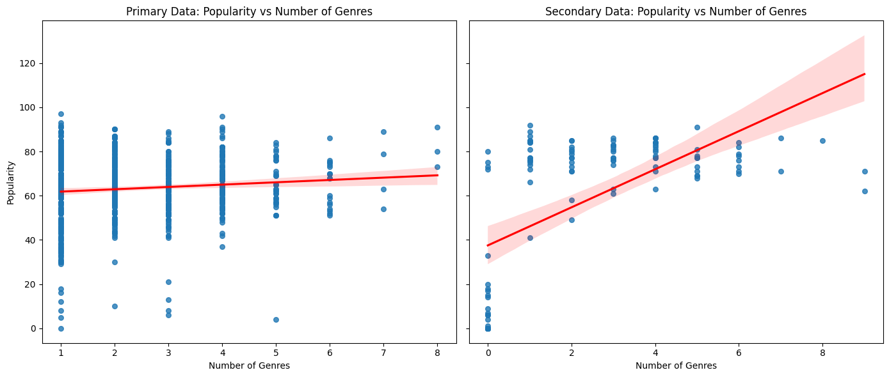
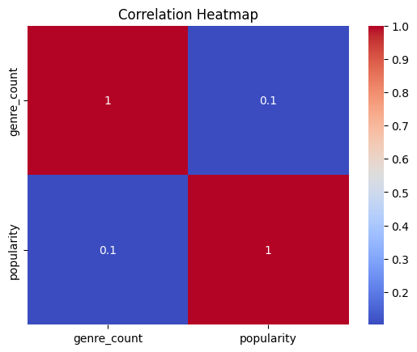
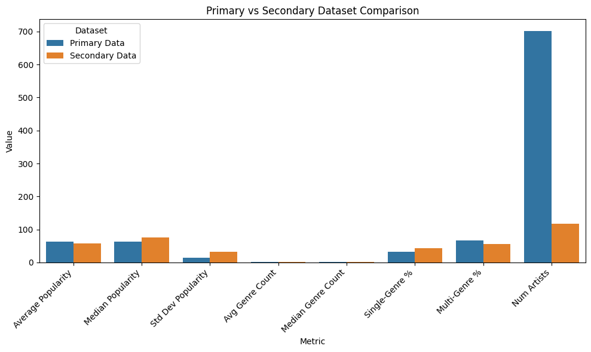

# 🎵 Does Genre Diversity Predict an Artist's Popularity on Spotify?

An end-to-end data science project that collects live data from the **Spotify Web API**, combines it with a secondary audio-features dataset, and uses statistical testing and machine learning to answer a single question:

> **Do artists who span more genres tend to be more popular?**

<p align="left">
  
  
  
  
  
</p>

[](https://colab.research.google.com/github/aljoharas/datascience/blob/main/spotifyproject.ipynb)

---

## 📌 Overview

This project follows the full data science lifecycle — **data collection → cleaning → exploratory analysis → hypothesis testing → predictive modeling** — to investigate whether the number of genres associated with an artist is linked to how popular they are.

The analysis works with **two independent datasets** to cross-validate findings:

| Dataset | Source | Size | Key fields |
|---------|--------|------|-----------|
| **Primary** | Collected live via the Spotify Web API (`spotipy`), seeded from Spotify's weekly Top-200 charts across **21 countries** | ~700 artists | genres, follower count, artist popularity |
| **Secondary** | A public Spotify tracks dataset with **audio features** | ~950 rows | danceability, energy, loudness, valence, tempo, popularity |

---

## ❓ Research Question & Hypotheses

- **H₀ (null):** The number of genres an artist spans has *no* relationship with their popularity.
- **H₁ (alternative):** Multi-genre artists have *different* (higher) popularity than single-genre artists.

---

## 🔬 Methodology

1. **Data collection** — Pulled artist names from 21 regional Spotify chart CSVs, then queried the Spotify API to enrich each artist with genres, followers, and a popularity score.
2. **Feature engineering** — Derived `genre_count` and labeled each artist as *single-genre* vs *multi-genre*; multi-hot encoded the top 50 genres.
3. **Exploratory data analysis** — Descriptive statistics, correlation heatmaps, scatter/regression plots, and boxplots on both datasets.
4. **Hypothesis testing** — Shapiro–Wilk (normality), Levene's test (equal variance), then a Mann–Whitney U test, with **Cohen's *d*** for effect size.
5. **Predictive modeling** — Compared a baseline against multiple models: Linear Regression, Random Forest, and XGBoost, evaluated with train/test split, cross-validation, and **MAE / RMSE / R²**.

---

## 📊 Key Results

**Genre count alone is a weak predictor of popularity — but audio features change the story.**

| Test | Result | Interpretation |
|------|--------|----------------|
| Pearson correlation (genre count vs popularity) | r = 0.10 (p = 0.007) | Very weak positive linear relationship |
| Mann–Whitney U (single vs multi-genre) | p = 0.15 | **Fail to reject H₀** — no significant difference |
| Cohen's *d* | 0.22 | Small effect size |
| Mean popularity | single = 61.2, multi = 64.4 | Multi-genre artists are only marginally higher |

**Model performance (predicting popularity):**

| Model | Features | R² | RMSE |
|-------|----------|----|------|
| Baseline (Linear Regression) | genre count only | 0.01 | 16.1 |
| Linear Regression | + audio features | 0.33 | 13.3 |
| Random Forest | + audio features | 0.38 | 12.7 |
| **XGBoost** | + audio features | **0.37** | **12.9** |

> **Takeaway:** Genre diversity by itself barely moves the needle (R² ≈ 0.01). Once **audio features** (energy, loudness, danceability, valence…) are added, predictive power jumps to R² ≈ 0.38 — suggesting *how* a song sounds matters far more than *how many genres* an artist is tagged with.

---

## 📈 Selected Visualizations

| Popularity vs Number of Genres (Primary vs Secondary) |
|:--:|
|  |

| Correlation Heatmap | Primary vs Secondary Comparison |
|:--:|:--:|
|  |  |

---

## 🗂️ Repository Structure

```
datascience/
├── spotifyproject.ipynb          # Main analysis notebook (collection → modeling)
├── charts/                       # Raw data
│   ├── regional-*-weekly-*.csv   # Spotify Top-200 charts for 21 countries
│   └── spotifydataset.csv        # Secondary audio-features dataset
├── images/                       # Exported charts used in this README
├── data science report phase 3.pdf   # Full written report
├── IT362 Presentation.pdf        # Final presentation slides
├── poster card DS.pdf            # Project poster
└── logbook_phase{1,2,3}.pdf      # Phase-by-phase project logbooks
```

---

## 🛠️ Tech Stack

**Language:** Python

**Libraries:** pandas · NumPy · scikit-learn · XGBoost · SciPy · statsmodels · seaborn · matplotlib · spotipy

**Tools:** Jupyter / Google Colab · Spotify Web API · Git

---

## ▶️ How to Run

The fastest way is to open the notebook directly in Colab using the badge above.

To run locally:

```bash
# 1. Clone the repo
git clone https://github.com/aljoharas/datascience.git
cd datascience

# 2. Install dependencies
pip install pandas numpy scikit-learn xgboost scipy statsmodels seaborn matplotlib spotipy joblib

# 3. (Optional) Set Spotify API credentials to re-run data collection
export SPOTIPY_CLIENT_ID="your_client_id"
export SPOTIPY_CLIENT_SECRET="your_client_secret"

# 4. Launch the notebook
jupyter notebook spotifyproject.ipynb
```

> The data-collection cells require Spotify API credentials. If you don't have them, skip those cells — the analysis and modeling run directly on the CSV files already included in `charts/`.

---

## 📄 Project Deliverables

- 📊 [Full written report](data%20science%20report%20phase%203.pdf)
- 🖥️ [Presentation slides](IT362%20Presentation.pdf)
- 🪧 [Project poster](poster%20card%20DS.pdf)

---

## 👤 Authors
Aljohara Alsultan
Dana Alsalmi 
Noura Aljayan
Alya Almuqren
Layan Alhowaimel
